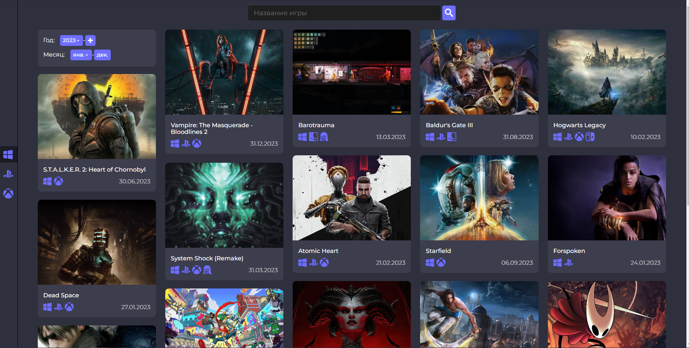
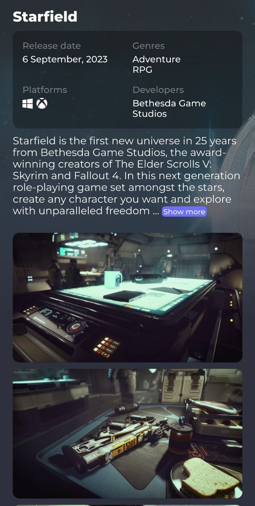

# VideoGames Explorer 🎮

VideoGames Explorer - это веб-приложение, которое позволяет вам просматривать и исследовать видеоигры с разных платформ и жанров.

Вы можете искать игры по названию, фильтровать их по платформе и дате выхода, и просматривать подробную информацию о каждой игре.

Вы можете опробовать приложение здесь: https://videogames-explorer.vercel.app/

## Скриншоты 🖼️

|  |  |
| :--------------------------------------------------: | -------------------------------------------------- |

## Технологии

Этот проект был создан с использованием:

- TypeScript
- React.js
- Redux
- SASS
- Axios
- [RAWG API](https://rawg.io/apidocs)

## Установка

Чтобы запустить этот проект локально:

1. Клонируйте этот репозиторий: `git clone https://github.com/XcQuake/videogames-explorer.git`
2. Установите зависимости: `npm install`
3. Создать `.env.local` файл в папке с приложнием и добавить ключ [RAWG API](https://rawg.io/apidocs)
   `REACT_APP_RAWG_API_KEY=ваш_ключ_rawg_api`
4. Запустите сервер разработки: `npm run dev`
5. Откройте http://localhost:3000 в вашем браузере
